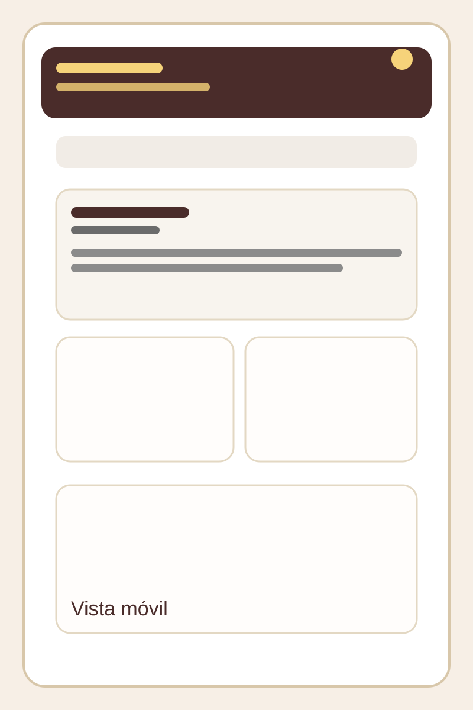
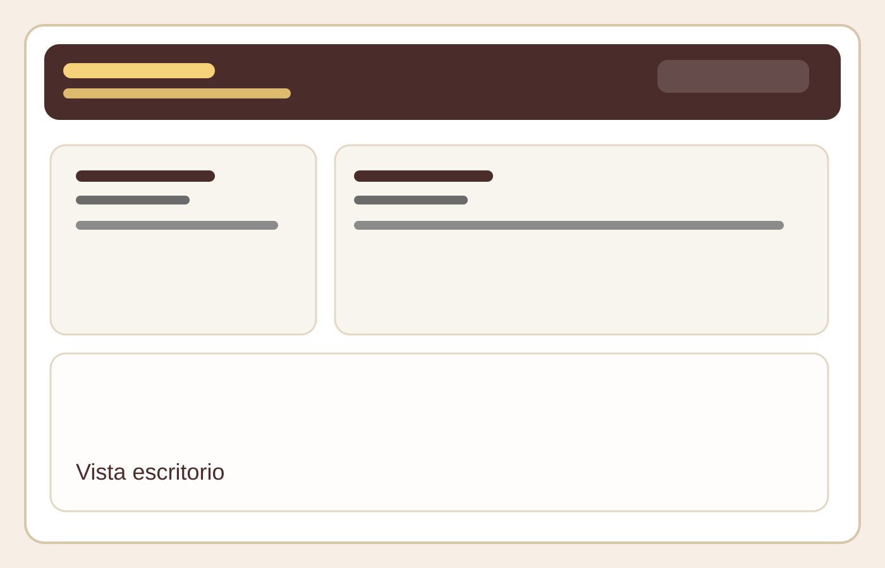

# Biblioteca

Sistema de gestión de biblioteca desarrollado con React, TypeScript y Tailwind CSS. La aplicación permite registrar libros, buscarlos, filtrarlos por diferentes criterios y consultar información general del proyecto desde una vista dedicada.

## Descripción del proyecto

Biblioteca es una aplicación web pensada como MVP para gestionar un catálogo de libros de forma simple y visual. Permite:

- agregar, editar y eliminar libros
- cambiar el estado de disponibilidad entre Disponible y Prestado
- buscar por título o autor
- filtrar por autor, género, año y estado
- navegar entre el catálogo y la sección “Acerca del Proyecto” sin recargar la página
- conservar los datos en el navegador mediante localStorage

## Tecnologías utilizadas

- React 18
- TypeScript
- Vite
- Tailwind CSS
- React Router DOM

## Requisitos previos

Antes de comenzar, asegúrate de tener instalado:

- Node.js 18 o superior
- npm 9 o superior
- Git

## Instalación

1. Clona el repositorio:

```bash
git clone <url-del-repositorio>
cd biblioteca
```

2. Instala las dependencias:

```bash
npm install
```

## Cómo ejecutar el proyecto

### Modo desarrollo

```bash
npm run dev
```

Luego abre la URL que indique Vite en tu navegador, normalmente:

```text
http://localhost:5173
```

### Compilar para producción

```bash
npm run build
```

El comando anterior genera una build lista para desplegar.

## Estructura general del proyecto

```text
src/
├── components/       # Componentes reutilizables como Header, Footer, BookCard, Carousel y formularios
├── data/             # Datos iniciales del catálogo
├── models/           # Tipos y modelos de TypeScript
├── pages/            # Páginas de la aplicación, como Acerca del Proyecto
├── utils/            # Funciones compartidas para validación y lógica de negocio
├── App.tsx           # Componente principal con la navegación y el flujo del catálogo
├── main.tsx          # Punto de entrada de React
```

## Funcionalidades implementadas

- Registro de libros con formulario validado
- Edición y eliminación de libros
- Cambio rápido de estado de disponibilidad
- Búsqueda por título o autor
- Filtros combinados por autor, género, año y estado
- Navegación entre páginas con React Router
- Diseño responsive y enfoque mobile first
- Persistencia local en el navegador

## Convenciones de código

El proyecto sigue un enfoque mobile first para el diseño y la experiencia.

### Reglas principales

- Las clases base de Tailwind se diseñan para pantallas pequeñas.
- Los breakpoints como `sm:`, `md:`, `lg:` y `xl:` se usan para mejorar la interfaz en pantallas más grandes.
- Se prefieren componentes pequeños, reutilizables y con responsabilidades claras.
- Se usan tipos de TypeScript para mantener el código más seguro y legible.
- La accesibilidad es parte del desarrollo: se priorizan etiquetas, foco visible y botones con texto claro.

## Capturas de pantalla

### Vista móvil



### Vista escritorio



## Mejoras futuras

Algunas mejoras que podrían incorporarse en próximos incrementos:

- conectar la app a una base de datos real
- agregar autenticación de usuarios
- permitir importar y exportar libros
- agregar filtros más avanzados y ordenamiento
- mejorar el sistema de pruebas automatizadas

## Autor

Matías

Año: 2026
